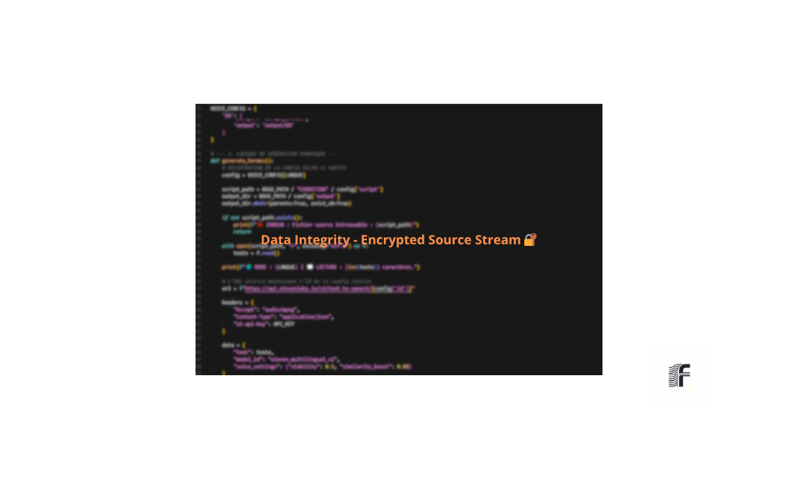

# 🤖 Documentation des Scripts (Cognition)

Cette section détaille le fonctionnement des moteurs de traitement de Foliotype Studio. Pour des raisons de sécurité et de propriété intellectuelle, le code source n'est pas détaillé ici.

---

## ⚡ HERMES - Core Engine
Ce script gère l'automatisation des flux et la distribution des actifs.

> 💡 **Note de confidentialité :** Les données sensibles (clés API, identifiants serveurs et noms de clients) sont volontairement floutées sur cette capture pour garantir la sécurité du process.

## 🧪 Simulation (Dry Run)
Avant chaque exécution réelle, nous utilisons ce module pour simuler les opérations et valider l'intégrité de la structure.

> 💡 **Note :** Le rapport d'audit permet de vérifier les chemins d'accès et les permissions sans modifier les fichiers sources. Les détails spécifiques du script sont confidentiels.

*Foliotype Studio - Documentation Interne*