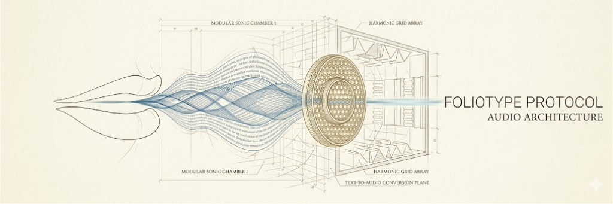

________________________________________________________________________________
[ SOURCE_ID: DOC-DATA-PERSISTENCE-EN-2026-V1.1 ]         [ F O L I O T Y P E ]
________________________________________________________________________________

#  &nbsp; D A T A _ P E R S I S T E N C E

## 1. Local Storage Integrity
The **Foliotype Protocol** requires strict verification of write permissions and data persistence. This ensures that every vocal asset generated by the **Hermes AI** engine is safely stored and indexed.

## 2. Write Permission Audit
Before execution, the system performs a diagnostic of the local file system:
* **Directory Access:** Validation of `output/EN/` and `output/FR/` availability.
* **Stream Persistence:** Verification that temporary audio buffers are correctly flushed to disk.
* **Disk I/O:** Monitoring for latency or write errors during the final mastering stage.

## 3. Storage Hierarchy
The data architecture follows a three-tier protection rule:
1. **Raw Scripts:** Textual sources stored in `docs/assets/workflow/`.
2. **Intermediate Assets:** Visual and technical logs in `docs/assets/scripts/`.
3. **Mastered Outputs:** Final audio files with embedded metadata.

---
**STATUS:** `STORAGE-VERIFIED`  
**PROTOCOL:** `FOLIOTYPE-PROTOCOL-V1.0`  

---
>  **F O L I O T Y P E  P R O T O C O L** | *Data Durability & Write Integrity*

________________________________________________________________________________
[ STATUS: CERTIFIED_TEXT_SOURCE ]                       [ CHECKSUM: VERIFIED ]