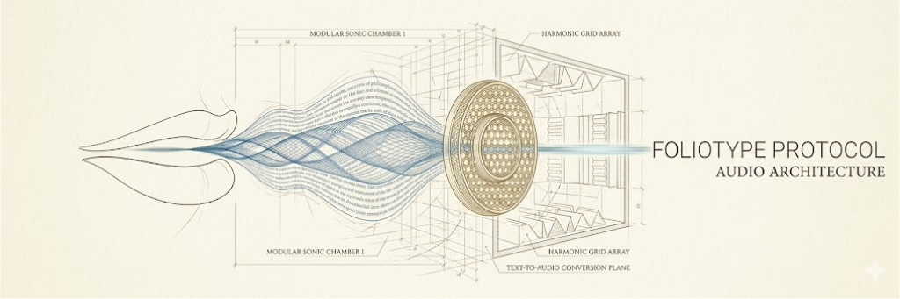

# BRAND ASSETS
**Identité visuelle dynamique et standards graphiques de Foliotype.**

  

    

  

## Éléments de Marque

### 📐 Logotype Foliotype (.svg)
Le logotype est l'élément central du système. Il utilise une construction géométrique précise mêlant lignes de force et typographie structurée.

* **Format SVG** : Garantit une netteté absolue sans pixellisation.
* **Design** : Structure monumentale portée par une trame de lignes dynamiques.

  

---

## Spécifications Techniques

| Asset | Format | Dossier Source | Usage |
| :--- | :--- | :--- | :--- |
| **Logotype** | `.svg` | `brand/` | Identité primaire, UI, Print. |
| **Bannière HD** | `.mp4` | `brand/` | Master vidéo (Le "Souffle"). |
| **Preview** | `.gif` | `assets/` | Affichage rapide, fallback web. |

---

  

*Dernière mise à jour : Mai 2026*
