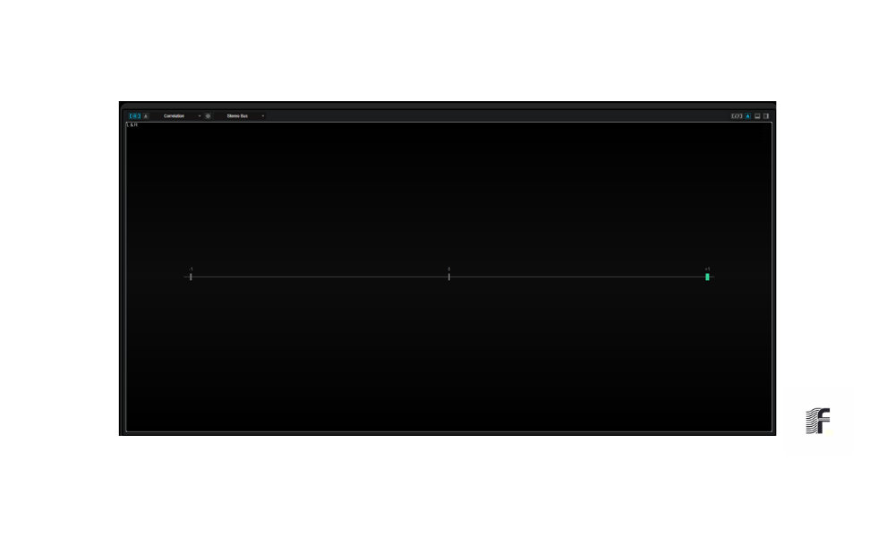

________________________________________________________________________________________
[ SOURCE_ID: DOC-AUDIO-ANALYSIS-EN-2026-V1.1 ]   **F O L I O T Y P E  P R O T O C O L**
________________________________________________________________________________________

A U D I O _ A N A L Y S I S

## 1. Compliance Protocol
This document certifies signal compliance with international broadcast standards under the authority of the **Foliotype Protocol**. Each project undergoes a rigorous three-dimensional analysis: **Loudness**, **Spatial Integrity (Stereo)**, and **Frequency Balance (Spectrum)**.

## 2. Loudness & Dynamics (-16 LUFS)
The signal is calibrated to **-16 LUFS Integrated**, ensuring perfect translation across streaming platforms without undergoing destructive algorithmic compression.
* **Standard:** EBU R128 / AES.
* **True Peak:** Capped at -1.0 dBTP to guarantee zero distortion during digital conversion.

## 3. Spatial Integrity & Phase Balance
Spatial domain analysis ensures the stability of the sound image. This control is crucial for **monophonic compatibility** and headphone immersion.
* **Panorama:** Monitoring light intensity for a perfectly symmetrical L/R balance.
* **Correlation:** Surgical phase verification to prevent frequency cancellation.

## 4. Spectral Analysis & Transparency
The frequency spectrum is monitored in real-time to validate tonal balance. This ensures maximum intelligibility of the **Hermes AI Voice** message.

---
**AUDIT:** `SIGNAL-INTEGRITY-CERTIFIED`  
**REFERENCE:** `ISO-226:2023-COMPLIANT`  

---
**Note Légale** : Ce projet est protégé par le droit d'auteur. Le protocole de scellage des masters a fait l'objet d'un dépôt d'antériorité référencé au registre e-Soleau (Dépôt du 15/05/2026).
Ref: FT-20260515-INPI-SOLEAU
---

  

## 1. Metadata Injection & MP3 Integrity
The final stage of the protocol ensures that the audio asset is self-documenting. Standardized ID3 tags are injected for traceability and seamless integration with broadcasting platforms.

## 2. Attestation of Compliance
This document certifies that the audio asset has been validated under the authority of the **Foliotype Protocol**. The **Certified Mastered** seal guarantees compliance with professional broadcasting requirements.

## 3. Signal Analysis (Supervision)
* **Loudness (EBU R128):** Normalized to **-16 LUFS**.
* **Spatial Integrity:** Positive phase correlation verified.
* **Tonal Balance:** Frequency spectrum calibrated for maximum clarity.

> [!IMPORTANT]
> Technical details: [`production_validation.md`](./production_validation.md)

## 4. Origin Validation (Data Integrity)
The produced audio is certified faithful to the optimized textual sources.
* **Certified Source:** [`source_text_en.md`](./source_text_en.md)
* **Transformation Workflow:** [`text_strategy_processing.md`](./text_strategy_processing.md)

---
**STATUS:** `COMPLIANT`  
**CERTIFICATION:** `FOLIOTYPE-PROTOCOL-AUDIT-2026`  
**SIGNAL:** `PASS`

---

  <a href="../README.md"><b>🏠 Back to Home</b></a>

__________________________  __________________________
[ STATUS: CERTIFIED_TEXT_SOURCE ]                       [ CHECKSUM: VERIFIED ]

---
**Legal Note**: This project is protected by copyright. The master sealing protocol has been subject to a prior deposit referenced in the e-Soleau register (Deposit dated 05/15/2026).
Ref: FT-20260515-INPI-SOLEAU
