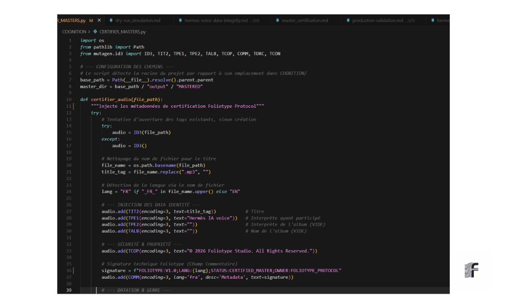

________________________________________________________________________________
[ SOURCE_ID: DOC-CERTIFIED-FR-2026-V1.1 ]   [  F O L I O T Y P E ]
________________________________________________________________________________

#  &nbsp; C E R T I F I C A T I O N _ M A S T E R _ E X P O R T &nbsp; 

  

## 1. Injection de Métadonnées & Intégrité MP3
L'étape finale du protocole garantit que l'actif audio est auto-documenté. Des balises ID3 standardisées sont injectées pour la traçabilité et l'intégration aux plateformes.

## 2. Attestation de Conformité
Ce document certifie que l'actif audio a été validé sous l'autorité du **Protocole Foliotype**. Le sceau **Certified Mastered** garantit la conformité aux exigences de diffusion.

## 3. Analyse du Signal (Supervision)
* **Loudness (EBU R128) :** Normalisé à **-16 LUFS**.
* **Intégrité Spatiale :** Corrélation de phase positive vérifiée.
* **Équilibre Tonal :** Spectre calibré pour une clarté maximale.

> [!IMPORTANT]
> Détails techniques : [`production_validation.md`](./production_validation.md)

## 4. Validation de l'Origine
L'audio est certifié fidèle aux sources textuelles optimisées.
* **Source Certifiée :** [`source_text.md`](./source_text.md)
* **Workflow :** [`strategie_traitement_texte.md`](./strategie_traitement_texte.md)

---
**STATUT :** `CONFORME`  
**CERTIFICATION :** `FOLIOTYPE-PROTOCOL-AUDIT-2026`  
**SIGNAL :** `PASS`

---
>  **F O L I O T Y P E  P R O T O C O L** | [Analyse Audio](./analyse_audio.md)

  <a href="../README.md"><b>🏠 Retour à l'accueil</b></a>

__________________________  __________________________
[ STATUT : SOURCE_TEXTE_CERTIFIÉE ]                       [ CHECKSUM : VÉRIFIÉ ]