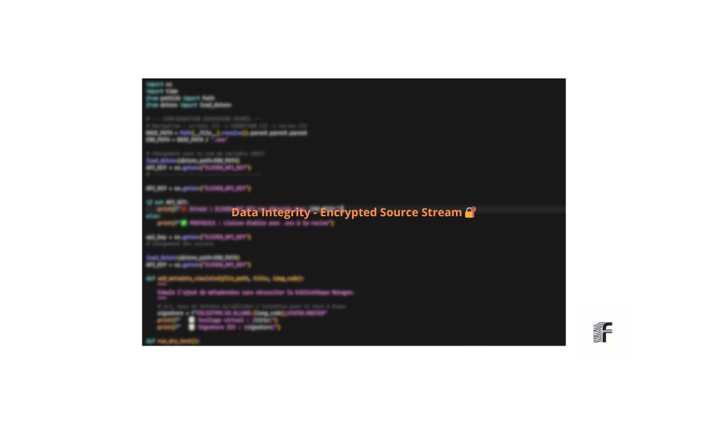

________________________________________________________________________________
[ SOURCE_ID: DOC-DRY-RUN-FR-2026-V1.1 ]                  [ F O L I O T Y P E ]
________________________________________________________________________________

S I M U L A T I O N _ D R Y _ R U N

## 1. Concept du Protocole
Le **Dry Run** est une étape de simulation obligatoire avant tout export final. Il sert à valider l'intégrité de la chaîne de traitement sans mobiliser les ressources de stockage définitives.

## 2. Points de Contrôle (Checklist)
Avant de valider une session, les éléments suivants sont passés au peigne fin :
* **Routing :** Vérification qu'aucun signal ne sature les bus internes.
* **Automatisations :** Lecture complète pour détecter d'éventuels artefacts ou sauts de gain.
* **Charge CPU :** Stabilité du système pendant le rendu en temps réel.

## 3. Validation Visuelle
L'image ci-dessous illustre une configuration de test conforme aux standards du studio (Capture Terminal) :

---
**STATUT :** `SIMULATION-READY`  
**PROTOCOLE :** `FOLIOTYPE-PROTOCOL-V1.0`  

---

  

## 1. Metadata Injection & MP3 Integrity
The final stage of the protocol ensures that the audio asset is self-documenting. Standardized ID3 tags are injected for traceability and seamless integration with broadcasting platforms.

## 2. Attestation of Compliance
This document certifies that the audio asset has been validated under the authority of the **Foliotype Protocol**. The **Certified Mastered** seal guarantees compliance with professional broadcasting requirements.

## 3. Signal Analysis (Supervision)
* **Loudness (EBU R128):** Normalized to **-16 LUFS**.
* **Spatial Integrity:** Positive phase correlation verified.
* **Tonal Balance:** Frequency spectrum calibrated for maximum clarity.

> [!IMPORTANT]
> Technical details: [`production_validation.md`](./production_validation.md)

## 4. Origin Validation (Data Integrity)
The produced audio is certified faithful to the optimized textual sources.
* **Certified Source:** [`source_text_en.md`](./source_text_en.md)
* **Transformation Workflow:** [`text_strategy_processing.md`](./text_strategy_processing.md)

---
**STATUS:** `COMPLIANT`  
**CERTIFICATION:** `FOLIOTYPE-PROTOCOL-AUDIT-2026`  
**SIGNAL:** `PASS`

---

  <a href="../README.md"><b>🏠 Back to Home</b></a>

>  **F O L I O T Y P E  P R O T O C O L** | [Audio Analysis](./audio_analysis.md)
________________________________________________________________________________
[ STATUS: CERTIFIED_TEXT_SOURCE ]                       [ CHECKSUM: VERIFIED ]

**Note Légale** : Ce projet est protégé par le droit d'auteur. Le protocole de scellage des masters a fait l'objet d'un dépôt d'antériorité référencé au registre e-Soleau (Dépôt du 15/05/2026).
Ref: FT-20260515-INPI-SOLEAU
