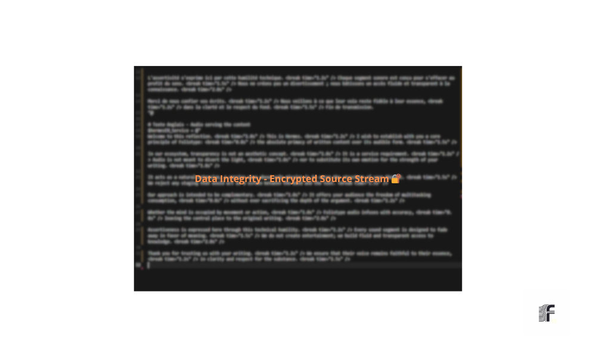
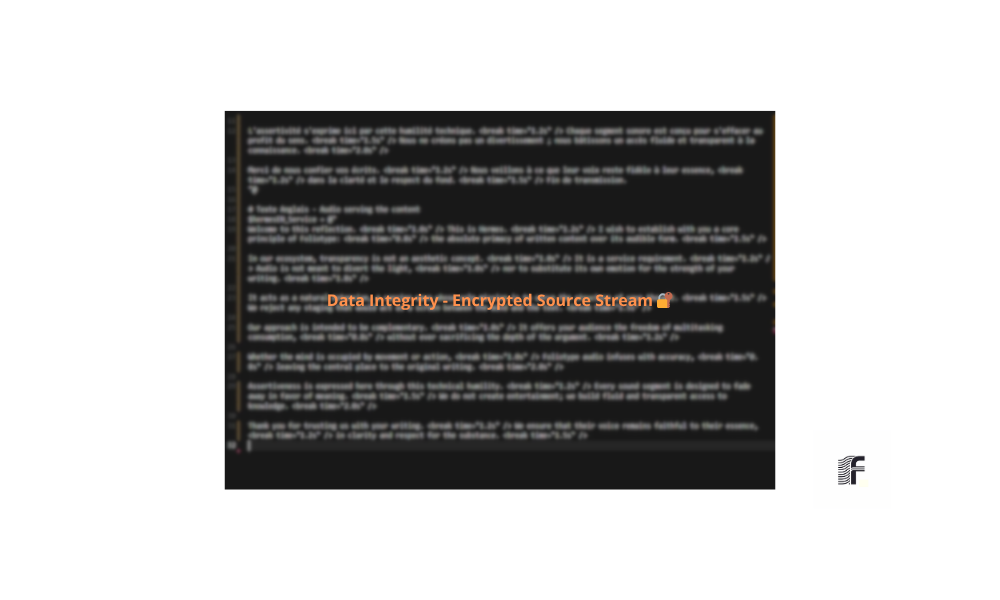
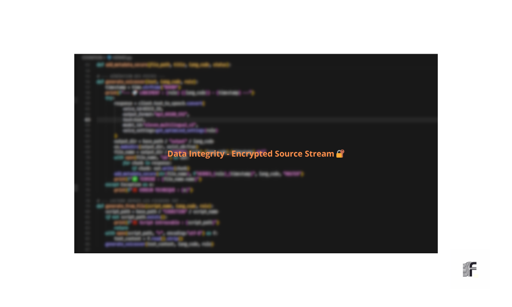

________________________________________________________________________________
[ SOURCE_ID: DOC-DATA-INTEGRITY-FR-2026-V1.1 ]           [ F O L I O T Y P E ]
________________________________________________________________________________

#  &nbsp; I N T É G R I T É _ D E S _ D O N N É E S

## 1. Transparence des Sources
Le système **Hermes AI Voice** repose sur une politique de "Source Ouverte". Sous l'autorité du **Foliotype Protocol**, nous exposons les fichiers sources textuels (EN/FR) pour garantir une traçabilité totale entre le texte brut et la synthèse vocale produite.

## 2. Référentiel des Scripts (Bilingue)
Les fichiers listés ci-dessous représentent la structure logique exploitée par le moteur. Ils définissent la prosodie, le rythme et les paramètres vocaux certifiés par le protocole.

* **Script de Configuration :** Visualisation via [`hermes_core_engine.png`](../assets/scripts/hermes_core_engine.png)
* **Architecture Technique :**

  

## 3. Le Processus de Transformation Text-to-Voice
La qualité du rendu repose sur le passage du texte "visuel" au texte "vocal" (Optimisation Phonétique).

### Étape 1 : Texte Source Brut (.txt)
Le contenu original tel qu'il a été conçu pour la lecture standard. Ces fichiers sont les piliers de l'audit sémantique.
* **Source FR :** [script_source_fr.txt](../assets/workflow/script_source_fr.txt)
* **Source EN :** [script_source_en.txt](../assets/workflow/script_source_en.txt)

### Étape 2 : Optimisation Phonétique & Logique
Le texte est retravaillé pour la diction via l'automatisation Cursor. Cette étape de "scripting" adapte la ponctuation pour guider l'IA vers une intonation humaine.
* **Flux Linguistique :** 
* **Piste d'Audit :** 

## 4. Engagement Qualité
L'exposition de ces fichiers atteste de la rigueur du **Foliotype Protocol** :
1.  **Absence de Biais :** Les textes sources sont immuables et vérifiables.
2.  **Précision Chirurgicale :** Chaque ponctuation est directement corrélée à une inflexion dans le rendu final.
3.  **Origine des Données :** 

### 5. Nature de l'Actif Vocal
Le moteur **Hermes AI Voice** est basé sur un modèle de clonage haute fidélité issu d'un corpus de **95 minutes de données audio réelles**.
* **Fidélité :** Haute résolution phonétique.
* **Éthique :** Usage strictement limité au cadre défini par le protocole.

---
**STATUT :** `DATA-VERIFIED`  
**PROTOCOLE :** `FOLIOTYPE-PROTOCOL-V1.0`  

---
>  **F O L I O T Y P E  P R O T O C O L** | [Conformité Acoustique & Transparence des Données](./AUDIO_ANALYSIS.md)

________________________________________________________________________________
[ STATUS: CERTIFIED_TEXT_SOURCE ]                       [ CHECKSUM: VERIFIED ]