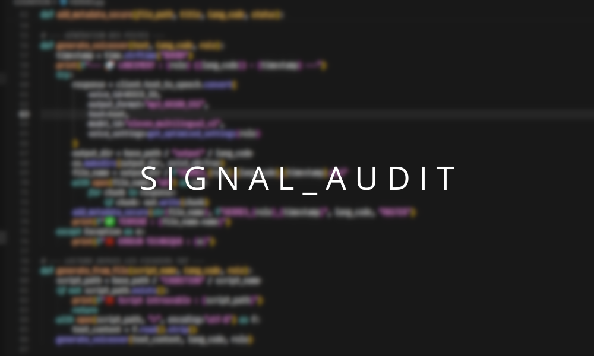

# 🎧 Foliotype Protocol : Pipeline Demonstration

  

---

## 🔍 01. Audit et Intégrité
Avant tout traitement, le signal subit un audit complet pour garantir l'absence de corruption numérique.

<table width="100%">
  <tr>
    <td width="50%">
      <b>Processus d'ingestion :</b> 
      • Extraction des métadonnées. 
      • Vérification de la structure du conteneur. 
      • Analyse de la cohérence binaire.
    </td>
    <td width="50%">
      
    </td>
  </tr>
</table>

---

  

  
   <i>Analyse fréquentielle et contrôle de phase</i>

---

## 03. Pipeline Cognition
Chaque étape est pilotée par le moteur `hermes.py` situé dans `/cognition/scripts/`.

*   **Automatisation** : Scripting Python pour une reproductibilité totale.
*   **Validation** : Le script `certified_mastered.py` génère le sceau de conformité.

  

---

### 📂 Documentation Technique
*   [📄 Analyse Audio détaillée](./fr/analyse_audio.md)
*   [📜 Certification Master](./fr/certification_master.md)
*   [✅ Production Validation](./fr/production_validation.md)

---

  <a href="./README.md"><b>🏠 Retour à l'accueil</b></a>

