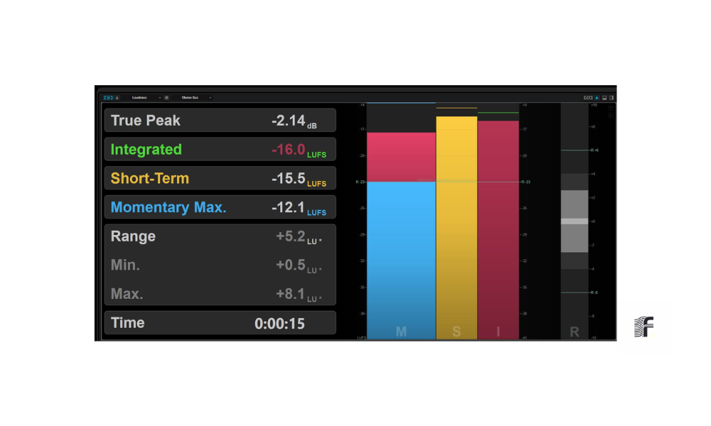
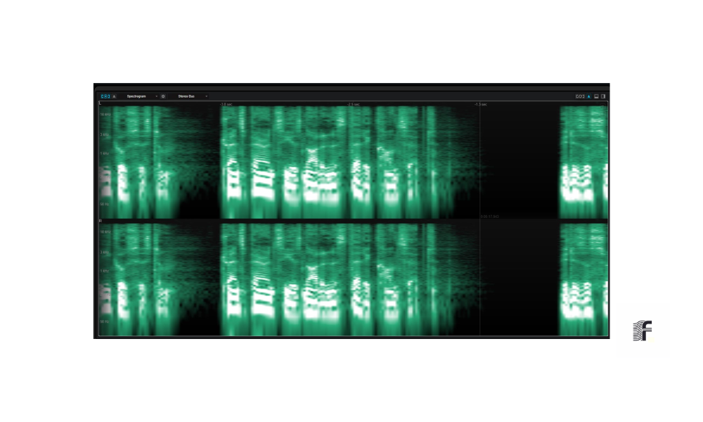

# Foliotype Protocol : Pipeline Demonstration

Ce document détaille les étapes techniques de certification et de traitement du signal.

---
### 1. Audit et Analyse du Signal

### 2. Mastering et Standardisation LUFS

### 3. Validation du Workflow

---
[Retour à l'accueil](./README.md)